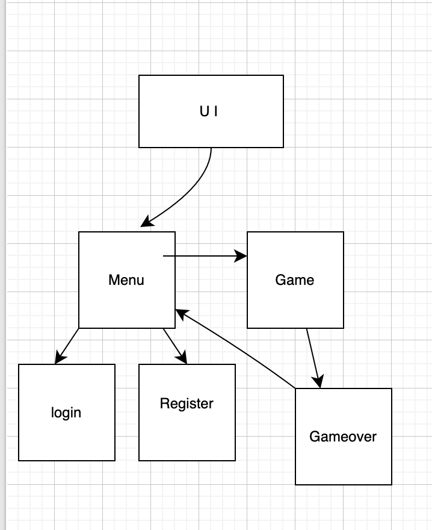

## Rakenne

- Sovelluksessa on UI joka hoitaa näkymien hallinnan.
- Menu joka näyttää aloitussivun(ehkä myös rekisteröitymisen/kirjautumisen)
- Game vastaa pelilogiikasta ja toiminnallisuudesta.

## Käyttöliittymä
- Toteutettu Tkinterillä.

## Sovelluslogiikka
- Sovelluksen käynnistäminen ja pelaaminen. Tällä on toiminnallisuus mistä pystyy siirtymään pelisivulle, mutta siellä ei vielä vasttausnapit toimi eikä tarkistusnappi. Sieltä pääsee myös aloitussivulle takaisin.
- Pisteiden tarkistus ja pelilogiikka Gamesissa.
  
## Päätoiminnallisuudet
- Pelaaminen. 
- Ajattelin aluksi tehdä kirjautumisen/rekisteröitymisen, mutta voi olla että aika ei riitä. 
## Käyttäjän kirjautuminen
- Katsotaan jos jää aikaa, näille on tehty kyllä omat login.py. 
## Uuden käyttäjän luominen
- - Katsotaan jos jää aikaa, näille on tehty kyllä omat register.py. 
## Pelin pelaaminen
- Käyttäjä pystyy siirtymään peliin aloitusvalikosta. Kun vastsa väärin, peli päättyy.
- Vastausten tarkistamista eikä kysymyksiä ole vielä toteutettu.
## Muut toiminnallisuudet
- Pisteiden lasku jos jää aikaa
