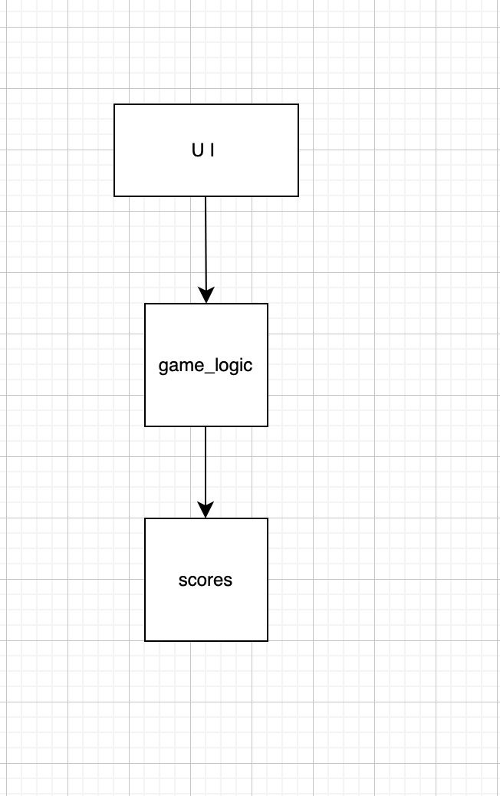
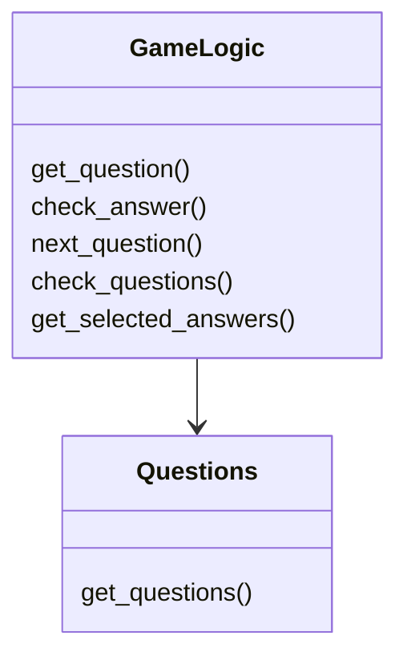
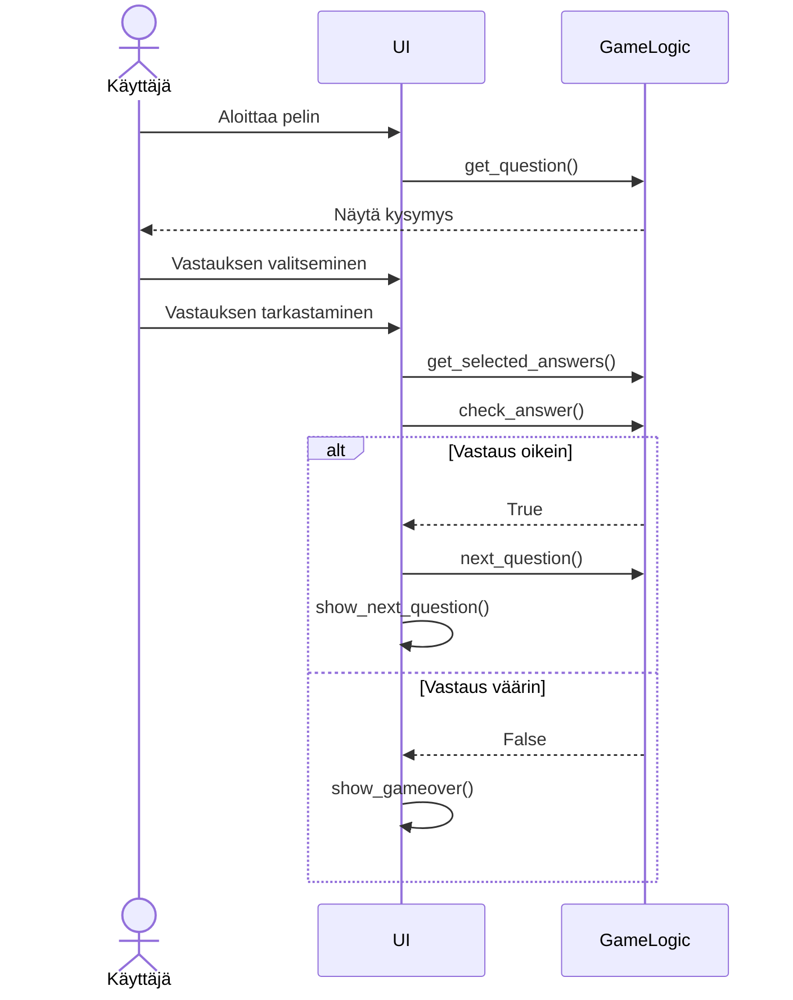
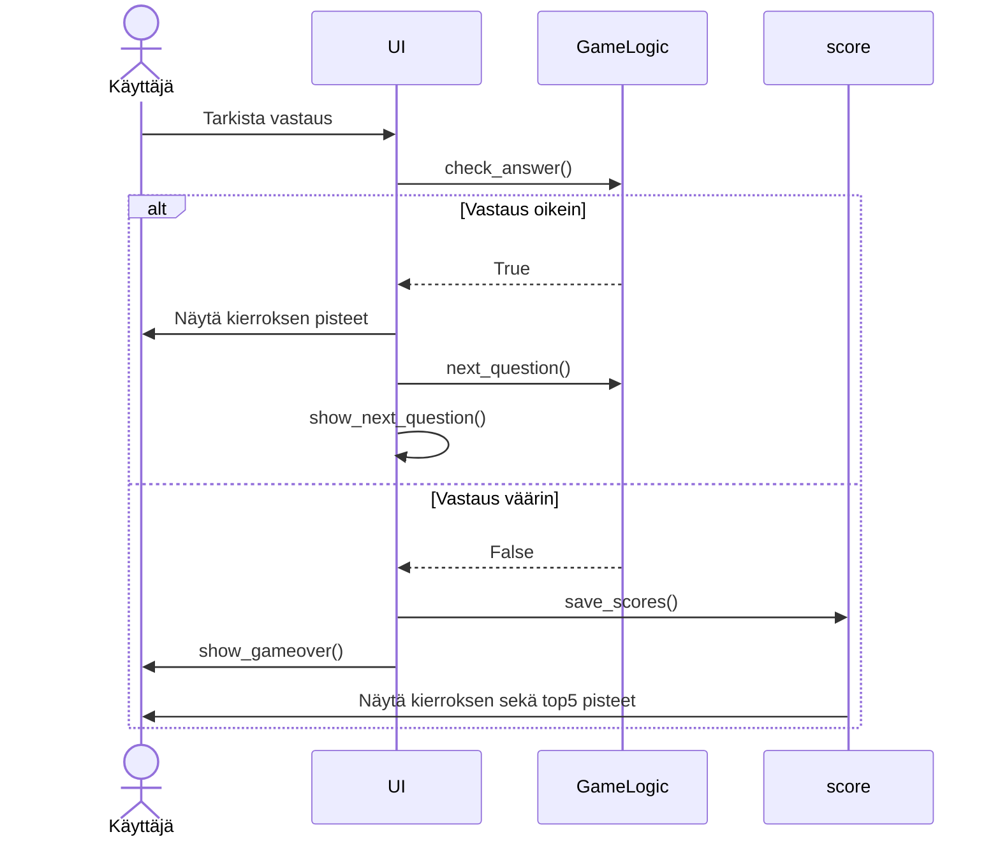

## Rakenne
Ohjelman rakenne:

- Pakkaus UI sisältää käyttöliittymän.
- Pakkaus game_logic sisältää pelin logiikan ja kysymyksiin liittyvän käsittelyn.
- Pakkaus scores sisältää pisteiden tallennukse ja hakemisen.

## Käyttöliittymä
Ohjelman käyttöliittymässä on kolme erillistä näkymää
- Aloitusruudu
- Pelinäkymä
- Pelin lopetus(häviö tai jos pääsee viimeiseen kysymyksenn)

ui.py hoitaa näkymien vaihtamisen. Näkymistä yksi on vain aina kerrallaan näkyvissä.

## Sovelluslogiikka

Sovelluksen logiikasta vastaa GameLogic-luokka. 
GameLogic - luokan metodeja joita se tarjoaa käyttöliittymälle:
-get_question
-check_answer
-next_question
-check_questions
-get_selected_answers
Luokka hoitaa kysymysten käsittelystä, vastauksien tarkistamisestta, pisteiden laskemisen ja seuraavaa kysymykseen siirtymisen. Kysymykset haettaan quizzes JSON-tiedostosta.
## Tietojen tallennus
Pisteet pidetään muistissa GameLogicissa pelin aikana, mutta lopussa ne tallennetaan score JSONiin.
## Päätoiminnallisuudet
Pelaaminen:
Käyttäjän aloittaessa pelin, käyttöliittymä hake kysymyksen GameLogic luokalta ja näyttää sen käyttäjälle. Vastaukse tarkistamisn jälkeen siirrytään seuraavaan kysymykseen, Game Over- näkymään tai viimeiseen kysymys näkymää.

Pisteiden tallennus
Käyttäjän vastatessa oikein, pisteitä päivitetään ja siirrytään seuraavaan kysymykseen. Vastatessa väärin pisteet tallennetaan scores JSON-tiedostoon ja ne näytetään Game Over -näkymässä.

## Pelin pelaaminen
- Käyttäjä pystyy siirtymään peliin aloitusvalikosta.
- Pelissä esitetään kysymyksiä ja niille 10 vastausvaihtoehtoa.
- Käyttäjä valitsee vastauksen ja se tarkistetaan.
- Jos käyttäjä vastaa väärin, peli päättyy ja käyttäjälle näytetään Game Over-näkymä.
- Jos käyttäjä vastaa oikein, hänelle näytetään seuraava kysymys.
- Jos käyttäjä on vastannut kaikkii oikein ja kysymyksiä ei enempää ole, näytetään hänelle 'voitto'ruutu.

## Muut toiminnallisuudet
- Käyttäjä pystyy valita nimimerkin
- Käyttäjä voi pelin jälkeen katsoa top 5 tilastoja.
