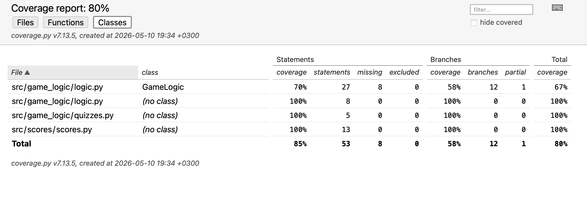

# Testausdokumentti
Ohjelmaa on testattu automatisoiduilla unittest-testeillä sekä manuaalisesti kokeilemalla
sovelluksen toimintoja käyttöliittymän kautta.

## Yksiikkö- ja integraatiotestaus

# Sovelluslogiikka
Sovelluslogiiikkaa testataan GameLogic-luokan testeillä. Testejä on mm. Vastausten tarkistus,
kysymyksen vaihtuminen sekä pisteiden laskeminen.

# Repositorio-luokat
Samassa testitiedostossa myös testataan quizzes.py ja scores.py tiedostoja omilla testeillä.
Testejä ovat mm. Top5 tilaston näyttäminen, nimimerkin ja pisteiden tallentaminen sekä pisteiden saaminen.
# Testauskattavuus
Testaus on 80% en tiedä miten olisin testannut get_selecteed_answers joten jätin sen tekemättä.

## Järjestelmätestaus
Sovellusta on testattu manuaalisesti käyttöliittymän kautta.

## Toiminnallisuudet
Sovelluksen toiminnnallisuuksia on testattu pitkin projektia mm. 
- Pelin aloittaminen
- Kysymykset eivät jää taustalle näkyviin jos lopettaa pelin.
- pistelaskuri toimii
- napit toimii
- oikean ja väärän kysymyksen tarkistus
- 1 oikea vastaus 1 väärä vastaus -> johtaa pelin päättymseen
- tyhjä vastaus päättää pelin
- pisteiden tallenns ja top 5 - lista.

  ## Sovellukseen jääneet laatuongelmat
  - Ulkoasu on puutteellinen, tekstin asettelu voisi olla parempi.

