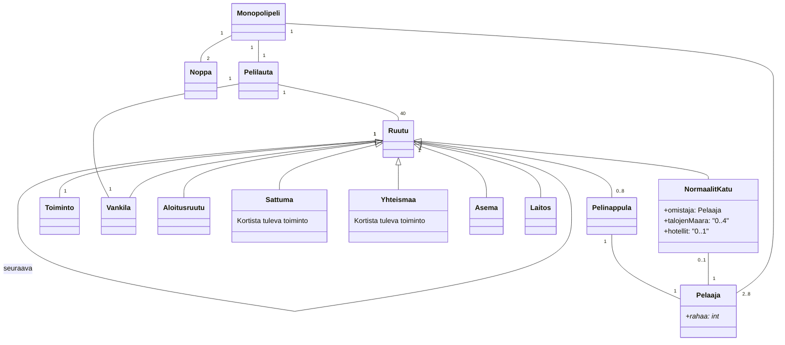

```mermaid
 classDiagram
    Monopolipeli "1" -- "2" Noppa
    Monopolipeli "1" -- "1" Pelilauta
    Pelilauta "1" -- "40" Ruutu
    Ruutu "1" -- "1" Ruutu : seuraava
    Ruutu "1" -- "0..8" Pelinappula
    Pelinappula "1" -- "1" Pelaaja
    Pelaaja "2..8" -- "1" Monopolipeli
    Ruutu "1" -- "1" Toiminto
    Pelilauta "1" -- "1" Vankila

    Ruutu <|-- Aloitusruutu
    Ruutu <|-- Vankila
    Ruutu <|-- Sattuma
    Ruutu <|-- Yhteismaa
    Ruutu <|-- Asema
    Ruutu <|-- Laitos
    Ruutu <|-- NormaalitKatu

    class Pelaaja {
        +rahaa: int*
    }

    class Sattuma {
        Kortista tuleva toiminto
    }
    

    class Yhteismaa {
        Kortista tuleva toiminto
    }
    
    NormaalitKatu "0..1" -- "1" Pelaaja

    class NormaalitKatu {
        +omistaja: Pelaaja
        +talojenMaara: "0..4"
        +hotellit: "0..1"
    }
    
    


```
