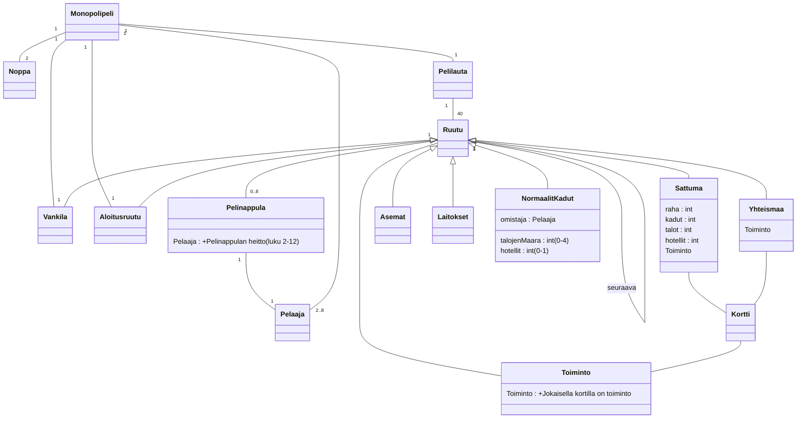

```mermaid
 classDiagram
    Monopolipeli "1" -- "2" Noppa
    Monopolipeli "1" -- "1" Pelilauta
    Monopolipeli "1" -- "1" Vankila
    Monopolipeli "1" -- "1" Aloitusruutu

    Pelilauta "1" -- "40" Ruutu

    Ruutu "1" -- "1" Ruutu : seuraava
    Ruutu "1" -- "0..8" Pelinappula
    Ruutu -- Toiminto
    Pelinappula "1" -- "1" Pelaaja
    Pelaaja "2..8" -- "1" Monopolipeli
    Sattuma -- Kortti
    Yhteismaa -- Kortti
    Kortti -- Toiminto
    Ruutu <|-- Aloitusruutu
    Ruutu <|-- Vankila
    Ruutu <|-- Sattuma
    Ruutu <|-- Yhteismaa
    Ruutu <|-- Asemat
    Ruutu <|-- Laitokset
    Ruutu <|-- NormaalitKadut

    class Sattuma{
        raha : int
        kadut : int
        talot : int
        hotellit : int
    }
    class Sattuma{

        Toiminto
    }

        class Yhteismaa{

        Toiminto
    }

        class NormaalitKadut{
        omistaja : Pelaaja
        talojenMaara : int(0-4)
        hotellit : int(0-1)
    }

        class Toiminto{
        Toiminto : +Jokaisella kortilla on toiminto
        
    }

        class Pelinappula{
        Pelaaja : +Pelinappulan heitto (luku 2-12)
        
    }

```